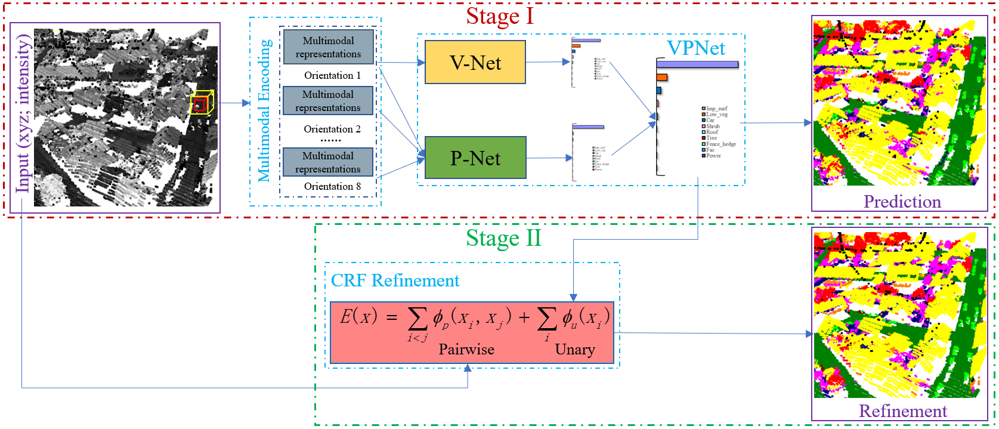
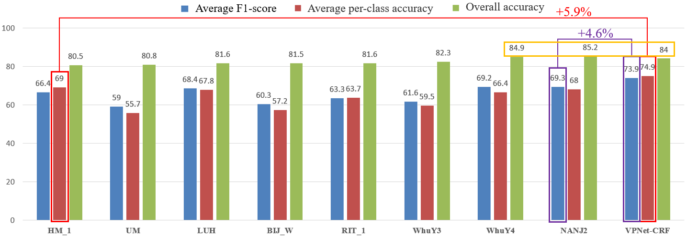
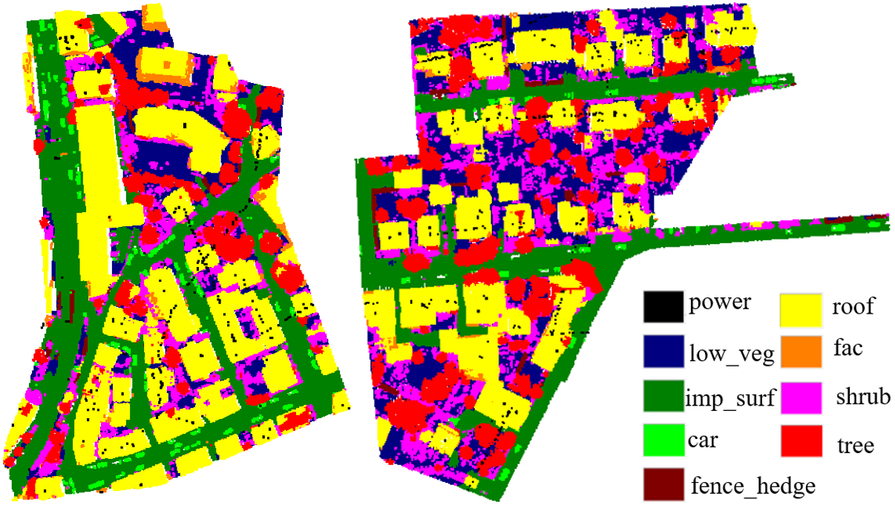
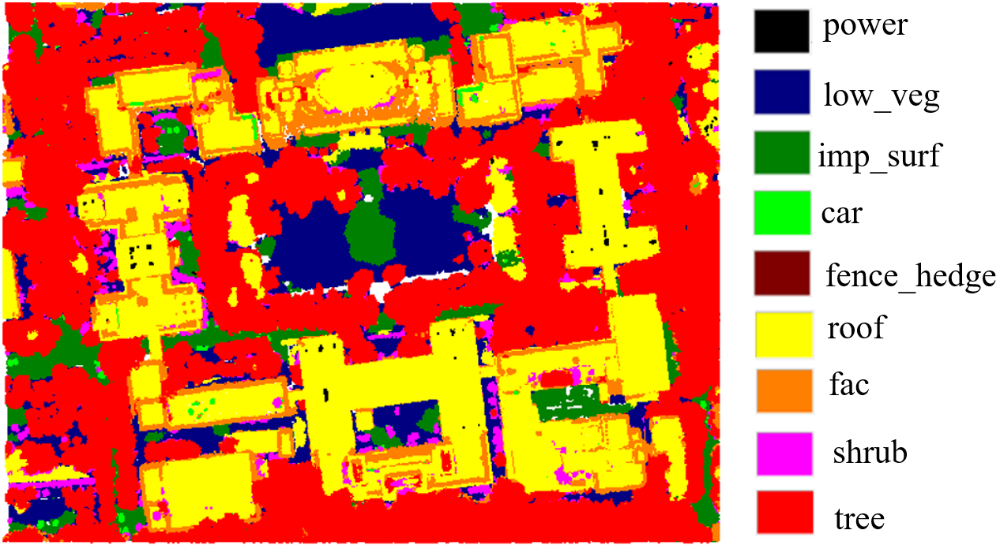

# Semantic Labeling of ALS Point Cloud via Learning Voxel and Pixel Representations

**Semantic Labeling of ALS Point Cloud via Learning Voxel and Pixel Representations** 

Nannan Qin, Xiangyun Hu*, Puzuo Wang, Yijing Li

**[[Paper](https://doi.org/10.1109/LGRS.2019.2931119)]**

# Abstract
Semantic labeling is a fundamental task that can provide useful semantics for many other 3-D processing tasks. To tackle the challenge of airborne laser scanning (ALS) point cloud classification, current state-of-the-art methods leverage the capabilities of deep learning. However, they are limited due to the weaknesses of the isolated use of individual representations of point clouds. To address this issue, this letter presents a novel network, VPNet, which ensembles voxel and pixel representation-based networks, to predict class probabilities for each light detection and ranging (LiDAR) point. A fully connected conditional random field-based global refinement is then performed over each point in the point cloud to produce a fine-grained classification result. On the ISPRS 3-D Semantic Labeling Contest, our solution sets a new state of the art by improving the highest average F1-score and the highest average per-class accuracy from 69.3% to 73.9%, and 69.0% to 74.9%, respectively. The overall accuracy of our approach is 84.0%.

# Framework

# Experiment
(1) Comparisons with State-of-the-art methods (ISPRS Vaihingen dataset)

(2) Classification result of VPNet-CRF **with the help of segmentation prior** (ISPRS Vaihingen dataset)

(3) Generalization (Test data from Wuhan University)

## Citation
Please consider citing our paper:

    @ARTICLE{Qin2020,
      author={N. {Qin} and X. {Hu} and P. {Wang} and J. {Shan} and Y. {Li}},
      journal={IEEE Geoscience and Remote Sensing Letters}, 
      title={Semantic Labeling of ALS Point Cloud via Learning Voxel and Pixel Representations}, 
      year={2020},
      volume={17},
      number={5},
      pages={859-863},
      doi={10.1109/LGRS.2019.2931119}}
